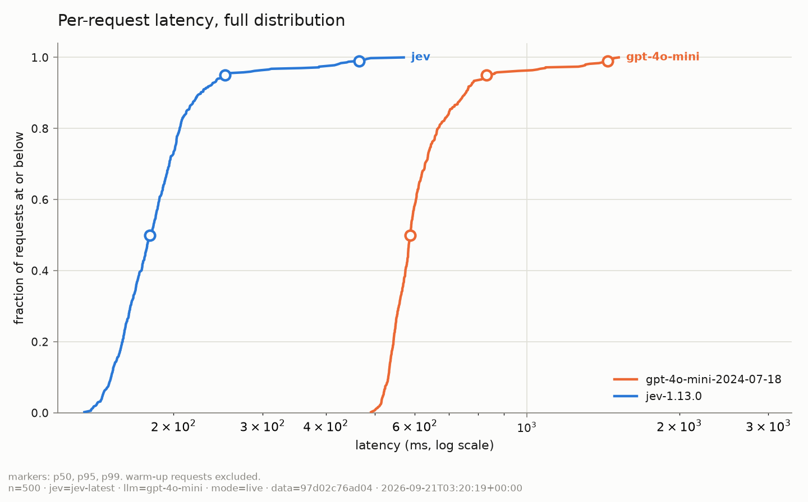
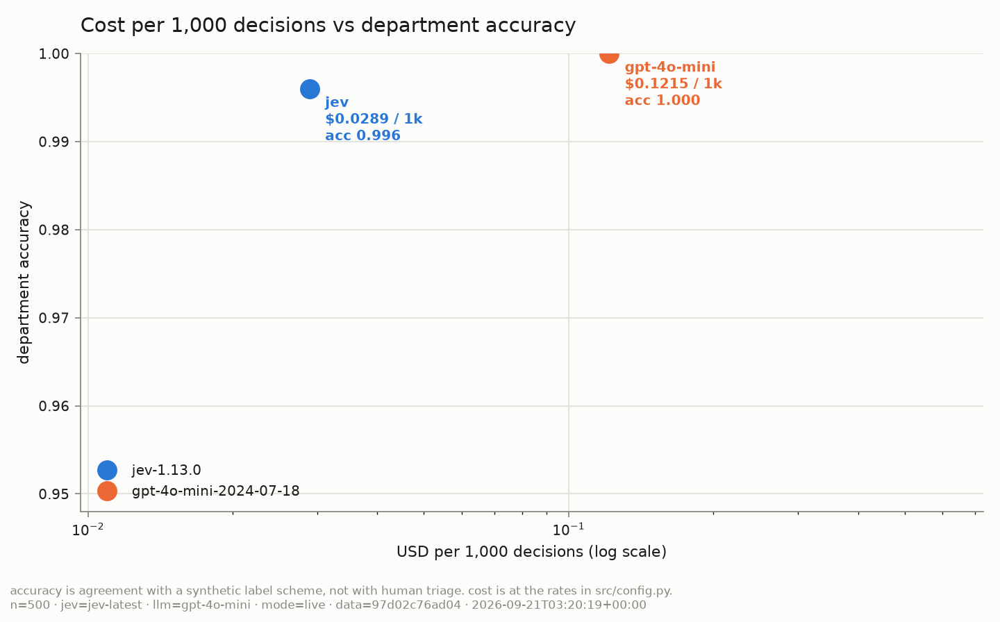
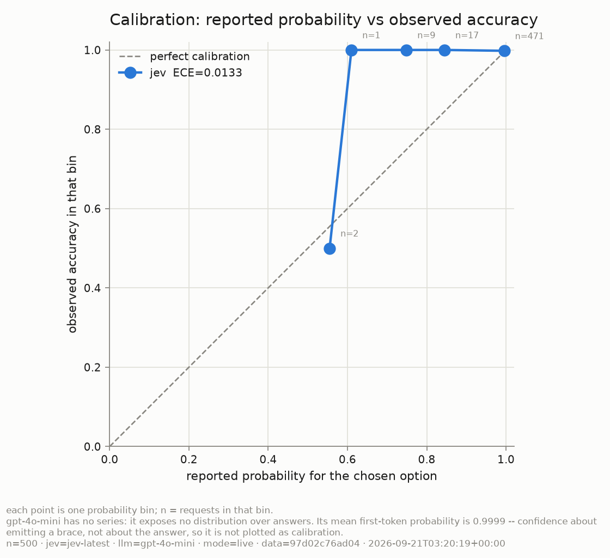

# When Your AI Should Decide, Not Generate

*Language models taught AI to talk to humans. Now we need AI that talks to software.*

---

A language model that generates a 4-field JSON object for a support-ticket triage
decision is doing something architecturally strange. It is running a 100-billion-
parameter autoregressive text generator -- a system built to produce paragraphs of
human-readable prose -- and asking it to emit a department name, an integer, and a
boolean. The generator does not know the answer and then serialise it; it discovers
the answer *while serialising*, one token at a time, with each token's distribution
conditioned on the tokens already committed. If the first field locks in the wrong
department, the remaining fields are generated in a universe where that department
is correct.

That is not a failure of any particular model. It is a category error: using a
System 2 deliberative process where a System 1 reflex would do.

This article benchmarks the difference. We run a purpose-built decision model
(Jev, from TypeSafe AI) against a conventional LLM with Structured Outputs on
500 synthetic triage scenarios and measure what the architecture buys: latency,
cost, schema reliability, calibration, and accuracy. The results are generated --
not typed -- and every number links back to the code that produced it.

## Methodology and provenance

Every number in this article is generated by
`analysis/render_article_tables.py` from `results/summary.json`. No result is
typed by hand. The summary is produced by `src/runner.py`, which stamps a
provenance block at write time. `--check` mode exits non-zero if the committed
tables drift from the summary, so the text and the data cannot silently disagree.

Two caveats, stated here rather than buried in a footnote:

1. **Simulated ECE is a property of the simulator.** The Jev simulator in
   `src/clients/jev_client.py` builds a probability distribution first and then
   samples its answer from that distribution's own masses. That makes it
   calibrated by construction: the residual ECE is finite-sample noise, not a
   measurement of any model. Only a `mode=live` run measures calibration.

2. **Ground truth is synthetic.** Labels are assigned first; ticket text is
   generated from labels. "Accuracy" therefore measures agreement with the
   generator's own scheme, not with human triage practice. Latency, cost, and
   schema conformance are unaffected and survive this caveat intact.

<!-- BEGIN:provenance -->
<!-- generated by analysis/render_article_tables.py -- do not edit -->

| | Simulated run | Live run |
|---|---|---|
| generated at (UTC) | TBD | 2026-09-21T03:20:19+00:00 |
| Jev model | TBD | `jev-latest` |
| LLM model | TBD | `gpt-4o-mini` |
| scenarios | TBD | 500 |
| dataset sha256 | TBD | `97d02c76ad04bfab...` |
| seed | TBD | 7 |
| code revision | TBD | `not a git repo` |

**Prices used:** `jev` $0.042/$0.000 per MTok (verified 2026-09-20), `gpt-4o-mini` $0.150/$0.600 per MTok (verified 2026-09-20), `claude-haiku-4-5` $1.000/$5.000 per MTok (verified 2026-09-20), `claude-sonnet-5` $2.000/$10.000 per MTok (verified 2026-09-20), `claude-opus-5` $5.000/$25.000 per MTok (verified 2026-09-20).

**Bedrock caveat:** cost computed at Anthropic first-party rates; Bedrock is partner-priced (historically ~2-3x) -- re-verify at https://aws.amazon.com/bedrock/pricing/ before quoting.

<!-- END:provenance -->

## The task

Both systems answer the same three questions about a support ticket:

- **Department** -- which team should own this ticket? (choice: billing,
  infrastructure_outage, account_security, feature_request)
- **Urgency** -- how time-critical is it? (5-level rubric, displayed on a 0-100
  scale)
- **Escalation** -- does it need immediate human-supervisor attention? (boolean)

The task definition lives in `src/schemas.py` and is consumed by both evaluators
unchanged, so neither side gets a better-worded question.

Jev answers all three in a single `system_one` request. The state (the ticket
text) is ingested once; the three questions are evaluated against it in parallel.
The LLM receives the same questions as a system prompt and generates a
`TriageDecision` JSON object via Structured Outputs.

## The paradigm shift: System 1 vs System 2

A token generator approaches a classification task the way a writer approaches an
essay: it reasons its way through, committing to each piece of the answer
sequentially. That is powerful when the task needs reasoning -- summarisation,
synthesis, open-ended analysis -- but it is the wrong tool when the task is a
decision with a known schema.

Jev is a different kind of model. TypeSafe AI describes it as a single-pass
decision system: state goes in, a probability distribution over the declared
options comes out. There is no autoregressive generation step, no token-by-token
sampling, no serialisation that can fail. The output is a distribution, not a
string that might parse as one.

That architectural difference shows up in four measurable ways:

1. **Latency.** A single-pass read is faster than an autoregressive decode.
2. **Schema conformance.** The output *is* the schema; there is no parse step that
   can fail.
3. **Calibration.** The model returns a probability distribution over options,
   not a single token whose logprob is a proxy for confidence about something
   else entirely.
4. **Cost.** No output tokens to bill when the answer is a distribution.

## Results

### Latency

<!-- BEGIN:latency -->
<!-- generated by analysis/render_article_tables.py -- do not edit -->

| Metric | jev<br>(simulated) | gpt-4o-mini<br>(simulated) | jev<br>(live) | gpt-4o-mini<br>(live) |
|---|---|---|---|---|
| p50 latency (ms) | TBD | TBD | 179.6 | 587.5 |
| p95 latency (ms) | TBD | TBD | 252.7 | 831.6 |
| p99 latency (ms) | TBD | TBD | 465.4 | 1,443.2 |
| mean latency (ms) | TBD | TBD | 190.8 | 631.8 |
| sequential throughput (req/s) | TBD | TBD | 5.24 | 1.58 |
| requests | TBD | TBD | 500 | 500 |

<!-- END:latency -->

The latency distribution tells the story a bar chart of medians cannot: the
interesting part of a latency comparison is the tail, and a CDF on a log axis
shows the full shape.

<p align="center">
  <picture>
    <source media="(prefers-color-scheme: dark)" srcset="figures/latency_cdf_dark.png">
    
  </picture>
</p>

### Schema conformance

<!-- BEGIN:conformance -->
<!-- generated by analysis/render_article_tables.py -- do not edit -->

| Metric | jev<br>(simulated) | gpt-4o-mini<br>(simulated) | jev<br>(live) | gpt-4o-mini<br>(live) |
|---|---|---|---|---|
| schema conformance | TBD | TBD | 1.0000 | 1.0000 |
| retries spent reaching valid output | TBD | TBD | 0 | 0 |
| hard errors (no answer at all) | TBD | TBD | 0 | 0 |

<!-- END:conformance -->

Jev's output is structurally guaranteed: the API returns a typed answer object,
not a string. The LLM baseline uses Structured Outputs, which is highly reliable
but not total -- refusals, truncation, and the occasional invalid object mean a
retry loop is part of the cost. The `retries` row counts what it took; the
`schema conformance` row records whether a valid object was obtained at all.

Honest accounting: every retry attempt's tokens are billed, and every attempt's
latency is added to the record. A system that needed three tries to emit valid
JSON conformed in the end but did not do so for free.

### Cost

<!-- BEGIN:cost -->
<!-- generated by analysis/render_article_tables.py -- do not edit -->

| Metric | jev<br>(simulated) | gpt-4o-mini<br>(simulated) | jev<br>(live) | gpt-4o-mini<br>(live) |
|---|---|---|---|---|
| input tokens | TBD | TBD | 344,350 | 364,537 |
| output tokens | TBD | TBD | 44,051 | 10,148 |
| total cost (USD) | TBD | TBD | $0.0145 | $0.0608 |
| cost per 1,000 decisions (USD) | TBD | TBD | $0.0289 | $0.1215 |

<!-- END:cost -->

Jev's pricing is $42 per billion input tokens, with output tokens free. The
asymmetry is structural: a decision model's output is a distribution (a handful
of floats), not generated text. The LLM baseline bills for both input and output
tokens, and bills for retried attempts.

### Quality

<!-- BEGIN:quality -->
<!-- generated by analysis/render_article_tables.py -- do not edit -->

| Metric | jev<br>(simulated) | gpt-4o-mini<br>(simulated) | jev<br>(live) | gpt-4o-mini<br>(live) |
|---|---|---|---|---|
| department accuracy | TBD | TBD | 0.9960 | 1.0000 |
| department macro-F1 | TBD | TBD | 0.9960 | 1.0000 |
| escalation accuracy | TBD | TBD | 0.8940 | 0.9400 |
| urgency MAE (0-100 scale) | TBD | TBD | 9.15 | 8.10 |
| urgency RMSE (0-100 scale) | TBD | TBD | 17.14 | 14.66 |
| urgency MAE from the continuous score | TBD | TBD | 10.10 | -- |
| all three fields correct | TBD | TBD | 0.6300 | 0.6760 |

<!-- END:quality -->

Remember the caveat: ground truth is synthetic. These numbers measure agreement
with the generator's label scheme, not with human triage judgement. The
comparison is meaningful as a relative sanity check -- do both systems track the
labels at comparable rates? -- but not as an absolute quality claim.

<p align="center">
  <picture>
    <source media="(prefers-color-scheme: dark)" srcset="figures/cost_accuracy_dark.png">
    
  </picture>
</p>

### Calibration

<!-- BEGIN:calibration -->
<!-- generated by analysis/render_article_tables.py -- do not edit -->

| Metric | jev<br>(simulated) | gpt-4o-mini<br>(simulated) | jev<br>(live) | gpt-4o-mini<br>(live) |
|---|---|---|---|---|
| ECE, department choice | TBD | TBD | 0.0133 | -- |
| ECE, escalation | TBD | TBD | 0.1159 | -- |
| Brier score, escalation | TBD | TBD | 0.0794 | -- |
| ECE computed on `confidence` instead (not a probability) | TBD | TBD | 0.0204 | -- |
| mean first-token probability (a proxy, not a distribution) | TBD | TBD | -- | 0.9999 |

<!-- END:calibration -->

This is the table the article is really about.

Jev returns a probability distribution over every answer. `p_department` is the
mass the model placed on the option it chose; `p_escalate` is the raw float the
Noul primitive returns. These are genuine probabilities: ECE and Brier score
measure whether they mean what they say.

The LLM returns none of this. The closest thing it offers is the logprob of its
first generated token -- which is the probability of emitting an opening brace,
not the probability of the classification being correct. It is recorded as
`mean_first_token_proxy` to show the gap, and it is deliberately *not* plotted as
a calibration curve.

The `confidence` statistic Jev reports alongside each answer is *not* a
probability of correctness. It is a peakedness measure: `(n * peak - 1) / (n - 1)`.
The ECE computed on it is shown for contrast only -- to demonstrate that a
peakedness statistic and a calibration probability are not interchangeable, even
when both are numbers between 0 and 1.

### Reliability curve

<!-- BEGIN:reliability -->
<!-- generated by analysis/render_article_tables.py -- do not edit -->

**jev (live)** -- reported probability vs observed accuracy

| probability bin | requests | mean reported | observed accuracy |
|---|---|---|---|
| [0.0, 0.1) | 0 | -- | -- |
| [0.1, 0.2) | 0 | -- | -- |
| [0.2, 0.3) | 0 | -- | -- |
| [0.3, 0.4) | 0 | -- | -- |
| [0.4, 0.5) | 0 | -- | -- |
| [0.5, 0.6) | 2 | 0.5550 | 0.5000 |
| [0.6, 0.7) | 1 | 0.6100 | 1.0000 |
| [0.7, 0.8) | 9 | 0.7489 | 1.0000 |
| [0.8, 0.9) | 17 | 0.8447 | 1.0000 |
| [0.9, 1.0) | 471 | 0.9952 | 0.9979 |

<!-- END:reliability -->

The reliability curve plots reported probability against observed accuracy per
bin. Only an evaluator that reports a probability distribution can appear on it,
which is the asymmetry this benchmark exists to show.

<p align="center">
  <picture>
    <source media="(prefers-color-scheme: dark)" srcset="figures/reliability_dark.png">
    
  </picture>
</p>

## The Bicameral Agent Pattern

The benchmark frames Jev and the LLM as competitors, but the more useful framing
is complementary: a bicameral agent where each system does what it is good at.

```
                   ┌─────────────────────────────┐
   ticket ──────►  │     Jev  (System One)        │  ~100ms
                   │  department, urgency, escalate│
                   │  + probability distributions  │
                   └──────────┬──────────────────┘
                              │
                   ┌──────────▼──────────────────┐
                   │     Router / Guardrail       │
                   │  if escalate and p > 0.9:    │
                   │    page oncall               │
                   │  elif dept == feature_request:│
                   │    pass to LLM for synthesis  │
                   └──────────┬──────────────────┘
                              │
                   ┌──────────▼──────────────────┐
                   │     LLM  (System Two)        │  ~500ms+
                   │  draft a response, summarise,│
                   │  reason about the ticket      │
                   └─────────────────────────────┘
```

Jev handles the reflex layer: classify, score, decide, in ~100ms, with a
probability you can threshold on. The LLM handles the deliberative layer:
draft a customer response, summarise context for the agent, reason about an
ambiguous case the reflex layer was uncertain about.

The probability distribution is what makes the handoff work. A System 1 decision
with `p_department = 0.52` is not a confident routing; it is a signal to escalate
to System 2 for deliberation. A decision with `p_department = 0.97` can be acted
on without a second opinion. The LLM baseline has no equivalent signal -- its
first-token logprob does not tell you whether the classification is right.

## When NOT to use Jev

These are sourced from TypeSafe AI's own documentation
(`model-jaggedness/jev-1.13.md`), not invented:

- **Negation and scoping.** "This is *not* an outage" -- Jev answers the
  question you wrote, which may not be the question you meant. The benchmark
  dataset includes ~12% negation cases for this reason.
- **Not a calculator.** Arithmetic on values in the state is unreliable.
- **Unreliable counting.** "How many items?" is not a decision question.
- **Poor on hex/RGB/binary proximity.** Colour similarity, bitwise operations.
- **Dates as text.** Mixed date formats and relative dates widen the urgency
  distribution. The dataset includes ~10% mixed-date cases.
- **Multi-hop indirection.** "The config references a policy that references a
  rule" -- chains of indirection degrade accuracy.
- **Accuracy decays with irrelevant state.** Log spew padding (~20% of the
  dataset) tests this directly.
- **Not adversarial by default.** Prompt injection in the state is not defended
  against unless the task is designed to detect it.
- **Contradictory instructions.** If the criteria contradict each other, the
  distribution spreads rather than erroring.
- **No guaranteed structural invariants.** `P(noul)` need not equal
  `1 - P(not noul)`. No code in this benchmark relies on such an invariant.
- **Not a text generator.** If the task is "write a reply to this ticket," use
  the LLM. Jev returns distributions, not prose.

## Reproducing

```bash
git clone <this-repo>
cd jev-vs-llm-benchmark
python -m venv .venv && .venv/Scripts/activate
pip install -r requirements.txt

# simulated (no keys)
make bench && make figures && make article

# live Jev + simulated LLM (~$0.008)
# set TYPESAFE_API_KEY in .env, SIMULATE_JEV=false
make bench

# full live (~$0.42 at first-party Anthropic rates)
# set all keys, both SIMULATE flags to false
make bench && make figures && make article
```

The dataset is deterministic from seed 7. `make dataset` regenerates it; the
sha256 in the manifest must match.

---

*Methodology, code, and data: [github.com/\<your-org\>/jev-vs-llm-benchmark](.).*
*Price verification dates are in `src/config.py`. Re-verify before quoting
any cost number publicly.*
